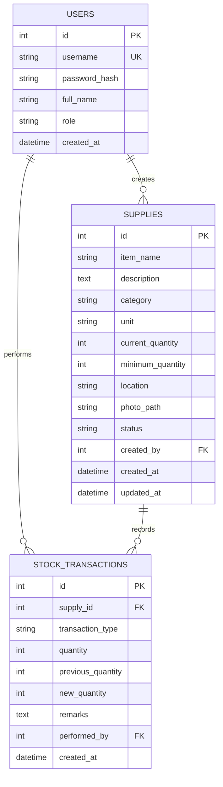

# Entity Relationship Diagram (ERD)

## Overview
This inventory system uses three core entities:

1. `users`
2. `supplies`
3. `stock_transactions`

The design is intentionally simple:

- A `User` creates supply records and performs stock movements.
- A `Supply` stores the current state of an item in inventory.
- A `StockTransaction` stores the movement history for each supply item.

## ERD Diagram

## Entity Details

### 1. `users`
Represents system accounts that can log in and use the application.

#### Primary Key
- `id`

#### Important Attributes
- `username`: unique login name
- `password_hash`: encrypted password storage
- `full_name`: display name in the application
- `role`: controls authorization, typically `admin` or `staff`
- `created_at`: account creation timestamp

#### Relationships
- One user can create many supplies.
- One user can perform many stock transactions.

#### Purpose in the system
This table is used for authentication, role-based access control, and audit tracking.

---

### 2. `supplies`
Represents each inventory item being tracked by the system.

#### Primary Key
- `id`

#### Foreign Key
- `created_by` → `users.id`

#### Important Attributes
- `item_name`: name of the stock item
- `description`: item details
- `category`: stock classification such as `Paper Products`, `Writing Instruments`, etc.
- `unit`: unit of measure such as `pcs`, `boxes`, `reams`
- `current_quantity`: present available quantity
- `minimum_quantity`: reorder threshold / low-stock threshold
- `location`: storage or assignment location
- `photo_path`: stored image path for the item record
- `status`: current stock state such as `in_stock`, `low_stock`, or `out_of_stock`
- `created_at`: when the item was first registered
- `updated_at`: latest update timestamp

#### Relationships
- One supply belongs to one creator user.
- One supply can have many stock transactions.

#### Purpose in the system
This is the main master table for inventory items. It stores the latest stock state so the dashboard, inventory list, stock card, and detail view can load quickly without recomputing totals from scratch every time.

---

### 3. `stock_transactions`
Represents every inventory movement for a supply item.

#### Primary Key
- `id`

#### Foreign Keys
- `supply_id` → `supplies.id`
- `performed_by` → `users.id`

#### Important Attributes
- `transaction_type`: `in` for stock-in/restock and `out` for issuance
- `quantity`: moved quantity
- `previous_quantity`: stock before the transaction
- `new_quantity`: stock after the transaction
- `remarks`: notes such as office, purpose, or issuance details
- `created_at`: transaction timestamp

#### Relationships
- Many transactions can belong to one supply.
- Many transactions can be performed by one user.

#### Purpose in the system
This table is the audit trail of inventory movement. It supports:

- stock history
- analytics
- transaction logs
- printable stock card generation

## Relationship Explanation

### `users` to `supplies`
**Relationship:** One-to-Many

- One user can create multiple supply records.
- Each supply record is created by exactly one user.

This is implemented by:
- `supplies.created_by` → `users.id`

---

### `users` to `stock_transactions`
**Relationship:** One-to-Many

- One user can perform many transactions.
- Each transaction is performed by exactly one user.

This is implemented by:
- `stock_transactions.performed_by` → `users.id`

This relationship is important for accountability and auditing.

---

### `supplies` to `stock_transactions`
**Relationship:** One-to-Many

- One supply item can have many transaction records.
- Each transaction record belongs to exactly one supply item.

This is implemented by:
- `stock_transactions.supply_id` → `supplies.id`

This relationship is the foundation of the stock card and stock movement history.

## Business Rules Reflected in the ERD

### 1. A supply must exist before transactions can be recorded
The system does not allow stock movement without an existing item in `supplies`.

### 2. Every stock movement is auditable
Each transaction stores:

- who performed it
- what item was affected
- how much quantity moved
- the quantity before and after the movement
- when it happened

### 3. Current stock is stored in `supplies`
Instead of calculating stock only from transaction history, the app stores `current_quantity` directly in `supplies` and updates it whenever a transaction occurs.

This improves:

- dashboard speed
- inventory browsing performance
- filtering by stock condition

### 4. Supply status is derived from quantity levels
The `status` field in `supplies` is updated based on business logic:

- `out_of_stock` when quantity is `0`
- `low_stock` when quantity is above `0` but at or below `minimum_quantity`
- `in_stock` otherwise

### 5. Duplicate supply creation is restricted
The service layer prevents duplicate items based on:

- `item_name`
- `unit`
- `location`

This keeps the `supplies` table acting as the master list, while additional stock is recorded through `stock_transactions`.

## Why This ERD Works Well for the Project

This structure is appropriate for the current application because it separates:

- **master data** in `supplies`
- **user/account data** in `users`
- **movement history** in `stock_transactions`

That gives the system:

- a clean audit trail
- easier analytics
- simpler authorization logic
- direct support for history and stock card printing

## Summary
The ERD is centered on `supplies`, with `users` handling ownership and accountability, and `stock_transactions` handling all inventory movement history.

In simple terms:

- `users` manage and operate the system
- `supplies` store the current inventory records
- `stock_transactions` store every stock-in and stock-out event

This is a normalized and practical structure for a small-to-medium inventory management application.
